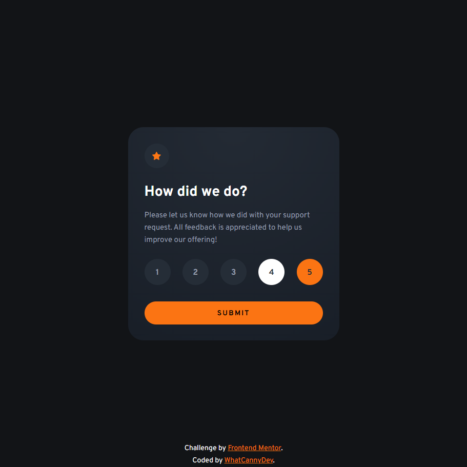

# Frontend Mentor - Interactive rating component solution

This is a solution to the [Interactive rating component challenge on Frontend Mentor](https://www.frontendmentor.io/challenges/interactive-rating-component-koxpeBUmI). Frontend Mentor challenges help you improve your coding skills by building realistic projects. 

## Table of contents

- [Overview](#overview)
  - [The challenge](#the-challenge)
  - [Screenshot](#screenshot)
  - [Links](#links)
- [My process](#my-process)
  - [Built with](#built-with)
  - [What I learned](#what-i-learned)
  - [Useful resources](#useful-resources)
- [Author](#author)

## Overview

### The challenge

Your challenge is to build out this interactive rating component and get it looking as close to the design as possible.

You can use any tools you like to help you complete the challenge. So if you've got something you'd like to practice, feel free to give it a go.

Users should be able to:

- View the optimal layout for the app depending on their device's screen size
- See hover states for all interactive elements on the page
- Select and submit a number rating
- See the "Thank you" card state after submitting a rating

### Screenshot




### Links

- Solution Repository URL: [Click here](https://github.com/CannyRo/FrontendMentor_InteractiveRatingComponent_koxpeBUmI)
- Live Site URL: [Click here](https://cannyro.github.io/FrontendMentor_InteractiveRatingComponent_koxpeBUmI/)

## My process

### Built with

- Semantic HTML5 markup
- CSS custom properties
- Flexbox
- Mobile-first workflow
- Javascript Vanilla

### What I learned

I've learned that it's simpler to include the radio input in the label, set it to absolute position and size, and then reduce its opacity so that only the label is really styled.

To see how you did, see below:

```html
<label for="rating_1" class="label" id="rating_1_label">
  <input type="radio" id="rating_1" name="rating" value="1" class="input_radio"/>
  1
</label>
```
```css
.label{
  z-index: 1;
  position: relative;
  display: flex;
  align-items: center;
  justify-content: center;
  width: 42px;
  height: 42px;
  color: #daffc8;
  background-color: #162011;
  border-radius: 21px;
  font-size: 14px;
  line-height: 24px;
  font-weight: 700;
}
.labelRadio:hover{
  color: #162011;
  background-color: #55ff00;
}
.labelChecked{
    color: #162011;
    background-color: #ffffff;
}
input[type="radio"]{
    position: absolute;
    width: 42px;
    height: 42px;
    cursor: pointer;
    opacity: 0;
}
```

Then simply add or remove the “labelChecked” class with javascript to show or hide that an input has been selected.


### Useful resources

- [Styling Radio Buttons resource](https://www.sliderrevolution.com/resources/styling-radio-buttons/) - This helped me for styling the radio buttons and seeing different way to do it.
- [innerHTML vs innerText vs textContent](https://www.freecodecamp.org/news/innerhtml-vs-innertext-vs-textcontent/) - This is an amazing article which helped me remain why textContent is the best solution to inject text in Html element.

## Author

- Website - [WhatCannyDev is searching a work-study contract in France](https://cannyro.github.io/hire_mr_canny/en)
- Frontend Mentor - [@CannyRo](https://www.frontendmentor.io/profile/CannyRo)
- GitHub - [@CannyRo](https://github.com/CannyRo)
- LinkedIn - [Ronan CANNY](https://www.linkedin.com/in/ronan-canny-b29443277/)
